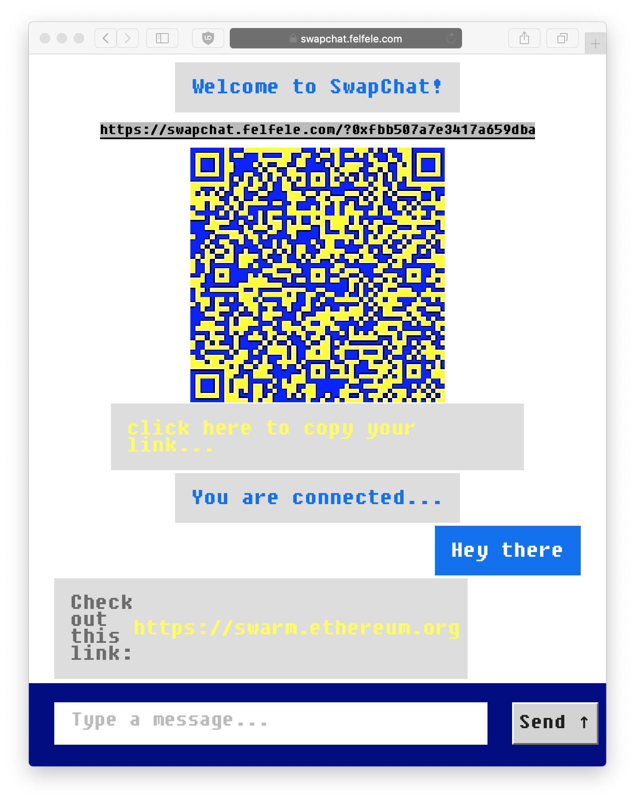

# SwapChat

SwapChat is a disposable, end-to-end encrypted, decentralized web app built on [Swarm](https://swarm.ethereum.org/). It uses ephemeral identities generated on the fly and then it does a Diffie-Hellman key exchange to create a shared secret for reasonable security and privacy.

The project was initally done as a Swarm Hackweek Madrid 2019 project as a collaboration between [@nolash](https://github.com/nolash) from the [Swarm team](https://swarm.ethereum.org/) and [@significance](https://github.com/significance) from [Fair Data Society](https://github.com/fairDataSociety) and [@agazso](https://github.com/agazso) from [Felfele](https://github.com/felfele).

[](screenshot.png)

### Building and running the app
```
 $ npm run pack
```

This builds the app in the `dist` directory. You can upload it to Swarm with the `upload.sh` command:

```
 $ ./upload.sh https://swarm-gateways.net
```
You can specify any Swarm gateways as an argument. After the upload was successful the script will write out a link to the uploaded website. Copy that link to your browser to open it.

### Testing

To test the connection logic:

1. run ts-node ./src/index.ts in terminal 1, and while running...
1. look for `tmp priv: <HASH>` in the output, and copy the hash
1. run ts-node ./src/index.ts <HASH> in terminal 2

### NGINX configuration for deployment

Here is an nginx configuration snippet if you want to deploy the application to your server with a proper DNS name (in this example `swapchat.felfele.com`).

First of all, we will need a fixed address that can be used in the webserver configuration. Therefore the app needs to be deployed to a feed and we will need the address of the manifest of that feed (in this example `014a3ad...38922a`).

Then you will need two `location` directives. The first one is responsible for forwarding the all `bzz` requests to passed to a Swarm node. The second one is responsible for serving static content from a certain manifest. This is where the app is deployed.

```
server {
    server_name swapchat.felfele.com;

    location ~ ^\/(bzz.*)$ {
        proxy_pass http://localhost:8500$request_uri;
        proxy_http_version 1.1;
        proxy_set_header Upgrade $http_upgrade;
        proxy_set_header Connection "upgrade";
    }

    location ~ ^\/(.*)$ {
        proxy_pass http://localhost:8500/bzz:/014a3adaed777c7c621fdafe4b59eb32e82c50eb5a242a5ed475aa2a8138922a/$1;
        proxy_http_version 1.1;
        proxy_set_header Upgrade $http_upgrade;
        proxy_set_header Connection "upgrade";
    }
}
```
